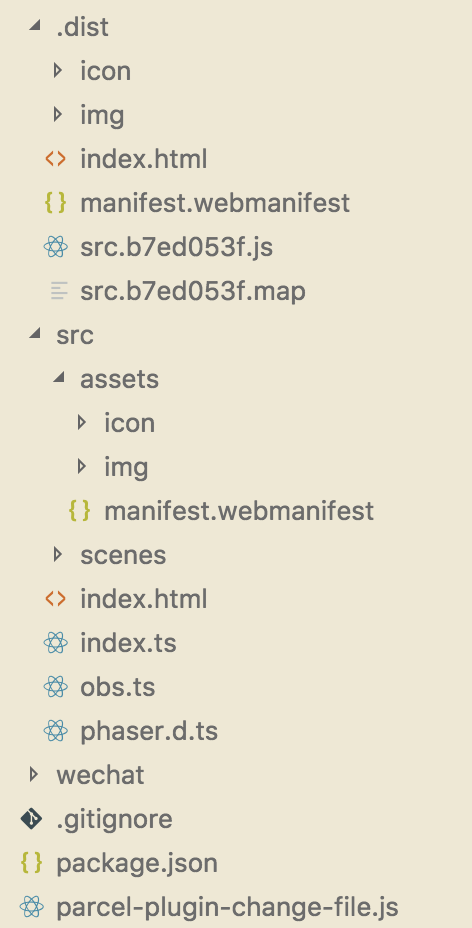

# :ambulance: parcel-plugin-change-file

[中文文档](./README-cn.md)

## :bulb: How ignore parcel bundler file ?

On Parcel build end, change index.html context, and copy static files in outDir

## :building_construction: Install

```sh
$ yarn add -D parcel-plugin-change-file
```

## :bookmark: Feature1: Exegesis index.html

Add `<!--[ your-code ]-->`

```html
<body>
  <!--[ <script src="lodash.min.js"></script> ]-->
</bodt>
```
The lodash.min.js jump to parcel bundler, this build end html:
```html
<body>
  <script src="lodash.min.js"></script>
</bodt>
```

## :lipstick: Feature2: Replace index.html

Add `<!-- parcel-plugin-change-file[i] -->` in index.html

```html
<header>
  <title><!-- parcel-plugin-change-file[0] --></title>
</header>
```

Create `parcel-plugin-change-file.js` in project-dir

```js
module.exports = {
  html: ['Product Name'],
};
```

parcel build end:

```html
<header>
  <title>Product Name</title>
</header>
```

## :truck: Feature3: Copy files to outDir

Create `parcel-plugin-change-file.js` in project-dir

```js
module.exports = {
  copy: ['src/assets'],
};
```

## :beer: OK, after build, we change static html and files!

File tree like this:




## How did ignore parcel-plugin-change-file feature?

Add `changeFile=false`

```
$ changeFile=false parcel index.html
```
